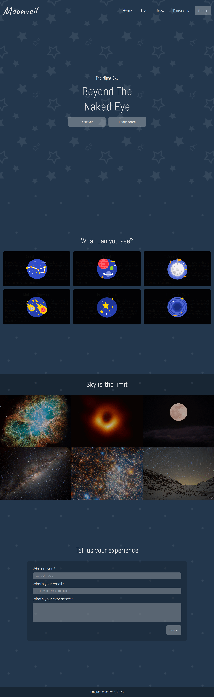

# Frontend Challenge - Moonveil

This is a solution for an academic challenge to improve HTML, CSS, SASS and Responsive skills.

## Table of contents

- [Overview](#overview)
  - [The challenge](#the-challenge)
  - [Screenshot](#screenshot)
  - [Links](#links)
- [My process](#my-process)
  - [Built with](#built-with)
  - [What I learned](#what-i-learned)
  - [Continued development](#continued-development)
  - [Useful resources](#useful-resources)
- [Author](#author)

## Overview

### The challenge

Users should be able to:

- View the optimal layout for the interface depending on their device's screen size
- See hover and focus states for all interactive elements on the page

### Screenshot

### Links

- Solution URL: [GitHub Repository](https://github.com/Diego024/moonveil)
- Live Site URL: [Website](https://moonveil-xi.vercel.app/)

## My process

### Built with

- CSS custom properties
- Flexbox
- CSS Grid
- SASS
- Mobile-first workflow

### What I learned

While I was working on this project I was able to learn more about the responsiveness using de different display types. I also put to work my understanding of the transitions in CSS.
And overall, I learned more about the implementation of SASS.

### Continued development

I want to keep practicing more my skills to create responsive designs with CSS. And start implementing some Javascript to my applications.

### Useful resources

- [Sass Documentation](https://sass-lang.com/documentation/) - This helped me to understand the implementation of Sass in my project.
- [Mozila Developer](https://developer.mozilla.org/en-US/) - This helped me to do my research to be able to apply some specific styles.

## Author

- Website - [Diego Pacheco](https://github.com/Diego024/)
